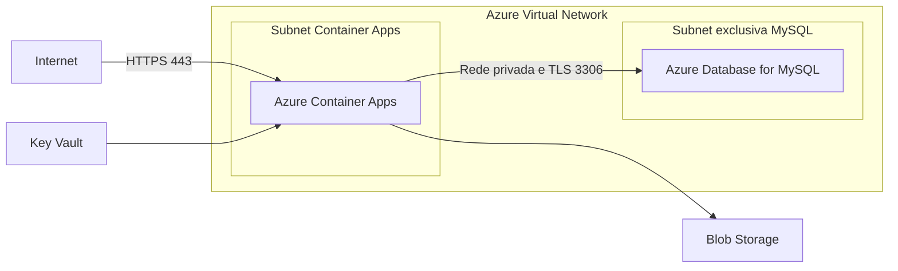
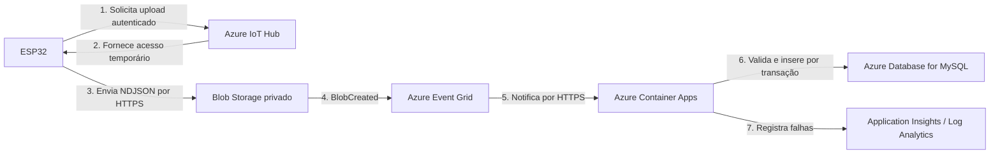

# Azure Database for MySQL em rede privada

## Pergunta

O correto é manter o Azure Database for MySQL em uma rede não pública para evitar exposição a ataques? É possível criá-lo em uma rede segmentada e conectá-lo à aplicação executada no Azure Container Apps, considerando que este último estará exposto por hospedar o front-end da aplicação?

## Resposta

Sim. Essa é a arquitetura recomendada: **somente o Azure Container Apps fica exposto à internet; o MySQL permanece acessível apenas pela rede privada**.



## Configuração recomendada

1. Criar uma **Azure Virtual Network**.
2. Criar uma subnet exclusiva para o ambiente do Azure Container Apps.
3. Criar outra subnet exclusiva e delegada ao MySQL Flexible Server.
4. Configurar o MySQL com **Private Access**.
5. Desabilitar o acesso público do MySQL.
6. Configurar a **Private DNS Zone** do MySQL e vinculá-la à VNet.
7. Configurar o Container Apps com **external ingress**, expondo apenas HTTPS.
8. Permitir que o Container App acesse o MySQL pela rede privada na porta `3306`.

O fato de o Container Apps estar público não torna o banco público. Ele funciona como a única porta de entrada:

```text
Internet -> HTTPS -> Container App -> Rede privada -> MySQL
```

O acesso direto abaixo ficará bloqueado:

```text
Internet -X-> MySQL
```

## Segmentação sugerida

```text
vnet-condoservicos
|-- snet-container-apps
|   `-- Azure Container Apps Environment
`-- snet-mysql
    `-- MySQL Flexible Server
```

A subnet do MySQL deve ser dedicada e delegada ao serviço `Microsoft.DBforMySQL/flexibleServers`. O Container Apps não deve ser colocado nessa mesma subnet.

## Proteções adicionais

- Usar NSGs para restringir o tráfego entre as subnets.
- Exigir TLS na conexão com o MySQL.
- Armazenar a credencial do banco no Azure Key Vault.
- Usar Managed Identity para o Container App acessar Key Vault, Blob Storage e ACR.
- Não gravar a senha do banco na imagem Docker.
- Restringir o CORS, sem considerá-lo uma proteção para o banco de dados.
- Considerar o Azure Front Door com WAF na frente do Container Apps.
- Usar autenticação, limitação de requisições e logs nas APIs públicas.
- Para o Blob Storage, considerar Private Endpoint ou acesso controlado por Managed Identity e SAS.

## Conclusão

A composição indicada é: **Azure Container Apps com entrada pública HTTPS e integração à VNet, conectado ao Azure Database for MySQL Flexible Server em uma subnet privada e sem endpoint público**.

## Envio dos logs de acesso do ESP32 para o Azure

### Recurso recomendado

Para o envio de um arquivo a cada 15 minutos, recomenda-se acrescentar o **Azure IoT Hub** e reutilizar o **Azure Blob Storage privado** já previsto para os arquivos de moradores. O IoT Hub fornece identidade individual, autenticação, revogação e o fluxo de upload de arquivo do dispositivo sem colocar a chave da conta de Storage no firmware.

O fluxo recomendado é:



Recursos adicionais aos já descritos neste documento:

- **Azure IoT Hub:** autentica cada ESP32 e intermedeia o upload seguro para o Blob Storage.
- **Azure Event Grid:** notifica a aplicação quando o arquivo terminar de ser gravado no Blob.

O Container App atual pode receber o evento do Event Grid, ler o arquivo usando sua Managed Identity e atualizar o MySQL pela rede privada. Portanto, não é obrigatório criar uma Azure Function. Caso se deseje separar completamente a ingestão da aplicação web, uma **Azure Function com Blob Trigger e integração à VNet** pode substituir essa etapa, mas isso acrescenta outro serviço e custo operacional.

Para uma prova de conceito com apenas um dispositivo, também seria possível o ESP32 chamar uma API HTTPS do Container App e receber uma SAS temporária de gravação. Entretanto, o IoT Hub é a escolha indicada para produção porque oferece identidade e revogação por dispositivo, auditoria e expansão para vários ESP32.

### Formato recomendado: NDJSON

O arquivo deve usar **NDJSON (Newline-Delimited JSON)** em UTF-8, com um objeto JSON completo por linha. Comparado ao CSV, ele preserva os tipos de `liberacao` e das datas, permite validação clara e pode ser processado linha a linha sem carregar todo o arquivo na memória. Também é mais tolerante a uma última linha incompleta em caso de falha de energia.

Exemplo de `acessos.ndjson`:

```jsonl
{"eventoId":"portaria-01-00000142","dispositivoId":"portaria-01","tagid":"23 7E 5B 63","acesso":"2026-09-04T17:30:12Z","liberacao":true}
{"eventoId":"portaria-01-00000143","dispositivoId":"portaria-01","tagid":"AA BB CC DD","acesso":"2026-09-04T17:31:03Z","liberacao":false}
```

Contrato dos campos:

| Campo | Tipo | Regra |
|---|---|---|
| `eventoId` | string | Obrigatório e único; impede inserção duplicada durante reenvios. |
| `dispositivoId` | string | Obrigatório; deve coincidir com a identidade autenticada no IoT Hub. |
| `tagid` | string | Obrigatório, até 20 caracteres, normalizado exatamente como em `moradores.TAGID`. |
| `acesso` | string | Obrigatório, data/hora ISO 8601 em UTC, sempre com sufixo `Z`. |
| `liberacao` | boolean | Obrigatório; `true` para liberado e `false` para negado. |

Embora a tabela atual tenha apenas TAGID, Acesso e Liberação, `eventoId` e `dispositivoId` são metadados necessários para confiabilidade e auditoria. O backend converte `acesso` de UTC para o padrão adotado no MySQL; recomenda-se manter o banco em UTC e converter apenas na apresentação.

O arquivo pode seguir o padrão:

```text
logs/{dispositivoId}/{AAAA}/{MM}/{DD}/{timestampUtc}-{sequencia}.ndjson
```

Exemplo:

```text
logs/portaria-01/2026/09/04/20260904T174500Z-00000981.ndjson
```

Cada arquivo deve ser imutável. Em uma tentativa posterior, o ESP32 deve reenviar o mesmo conteúdo e os mesmos `eventoId`, sem sobrescrever um arquivo já confirmado.

### Atualização recomendada no MySQL

No código e no banco atuais, a tabela se chama **`controle-acesso`**, com hífen, e não `controle_acesso`. Como o hífen exige crases em todas as consultas, recomenda-se padronizar futuramente o nome para `controle_acesso`. Enquanto essa migração não for feita, o importador deve usar o nome existente entre crases.

A chave estrangeira atual também impede armazenar uma tentativa negada de uma TAG que não exista em `moradores`. Para não perder eventos e não inserir dados inválidos diretamente na tabela final, recomenda-se criar uma tabela de ingestão que registre o estado do processamento:

```sql
CREATE TABLE controle_acesso_importacao (
    evento_id VARCHAR(80) NOT NULL,
    dispositivo_id VARCHAR(80) NOT NULL,
    tagid VARCHAR(20) NOT NULL,
    acesso DATETIME NOT NULL,
    liberacao BOOLEAN NOT NULL,
    recebido_em TIMESTAMP NOT NULL DEFAULT CURRENT_TIMESTAMP,
    status ENUM('PROCESSADO', 'REJEITADO') NOT NULL,
    motivo_rejeicao VARCHAR(255) NULL,
    PRIMARY KEY (evento_id),
    KEY idx_importacao_dispositivo_acesso (dispositivo_id, acesso)
);
```

Após validar que a TAG existe, a aplicação insere o evento na tabela final e marca a importação como processada, na mesma transação. TAG desconhecida, formato inválido ou horário fora da faixa aceita permanece como rejeitado para auditoria. A chave primária `evento_id` torna o consumo idempotente: se o Event Grid repetir uma notificação ou o ESP32 reenviar um lote, o registro não será duplicado.

### Processo no ESP32

1. Registrar cada tentativa imediatamente no armazenamento local, antes de depender da rede.
2. Usar relógio sincronizado por NTP e gravar `acesso` em UTC.
3. A cada 15 minutos, fechar o lote atual e iniciar outro arquivo.
4. Solicitar ao IoT Hub a autorização temporária para upload.
5. Enviar o arquivo ao Blob Storage somente por HTTPS e confirmar a conclusão ao IoT Hub.
6. Apagar o lote local apenas depois da confirmação do upload.
7. Em falha de rede, conservar o arquivo e tentar novamente com espera progressiva.
8. Limitar o armazenamento local e gerar alerta antes de ficar sem espaço.

O intervalo de 15 minutos não deve ser implementado apenas com um atraso contado após o envio, pois reinicializações deslocariam ou perderiam lotes. Deve ser usado um agendamento por janela de tempo, mantendo em armazenamento persistente os eventos ainda não confirmados.

### Validação e segurança

- Autenticar cada ESP32 no IoT Hub preferencialmente com certificado X.509 próprio; para o protótipo, uma chave simétrica individual é aceitável.
- Nunca incluir a connection string do IoT Hub, a chave da conta de Storage ou uma SAS permanente no firmware.
- Aceitar no Blob apenas HTTPS e bloquear acesso público ao container.
- Conferir se `dispositivoId` no conteúdo corresponde ao dispositivo que realizou o upload.
- Impor limite de tamanho, extensão `.ndjson`, quantidade máxima de linhas e intervalo aceitável de datas.
- Processar o arquivo como dados não confiáveis e usar consultas parametrizadas no MySQL.
- Manter o arquivo original por um período curto para reprocessamento e movê-lo logicamente para `processados/` ou `rejeitados/` após a ingestão.
- Configurar política de ciclo de vida do Blob para excluir arquivos antigos conforme a necessidade de auditoria e a LGPD.
- Gerar métricas para último upload por dispositivo, eventos processados, eventos rejeitados e atraso entre `acesso` e `recebido_em`.

### Sequência de implantação

1. Criar o IoT Hub e associar a ele um container privado do Storage para upload de arquivos.
2. Cadastrar uma identidade por ESP32.
3. Criar a tabela `controle_acesso_importacao`.
4. Implementar no Container App um endpoint autenticado para eventos `BlobCreated` do Event Grid.
5. Conceder à Managed Identity do Container App somente leitura no container de entrada.
6. Criar a assinatura do Event Grid com filtro para o prefixo `logs/` e sufixo `.ndjson`.
7. Implementar validação, inserção transacional e idempotência pelo `eventoId`.
8. Configurar retenção, alertas e painéis no Application Insights ou Log Analytics.

Com essa atualização, a arquitetura fica bidirecional: o Blob Storage distribui a lista criptografada de moradores para o ESP32 e também recebe os lotes de acesso, usando containers e permissões separados para cada finalidade.